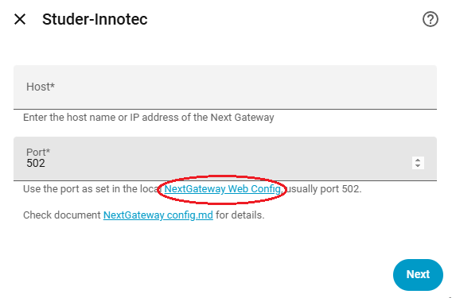
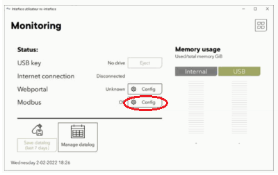
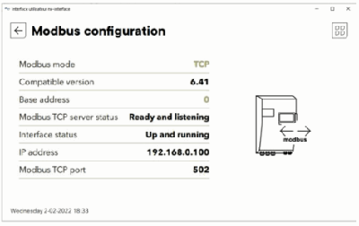

# Next Gateway configuration

This integration depends on having a Studer Next Gateway (part of the Next1 or Next3) acting as a modbus server that this integration can connect to

The Studer Next Gateway is able to simultaneously send data to the Studer online portal as well as sending data to this integration.

## Next Gateway Web-Config

The Next Gateway Web-Config can be used to setup and configure the Studer modbus server.
To open the web-config, click on the link that was detect during the first step of the integration configuration

Use the configuration settings described below to be able to connect both to the Studer-Innotec servers as well as to the Home Assistant integration.

- Open the Studer Next Gateway Web-Config
- Go to 'Monitoring'
- To the right of 'Modbus' press the 'Config' button
- Turn 'Modbus mode' On
- Use the following properties:
    * Modbus mode: TCP
    * Base address: 0
- Make a note of the other properties:
    * IP address (address of the Next3 or Next1)
    * Port (default is 502)

After a few seconds, the Studer modbus configuration should indicate Modbus TCP server status: 'Ready and listening'.

  
  
