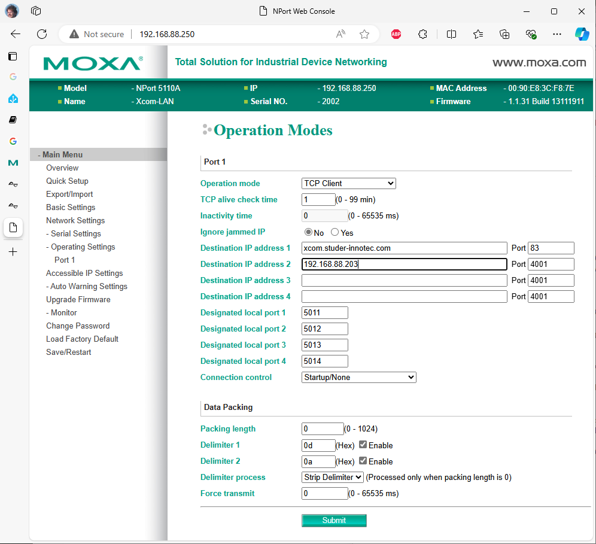
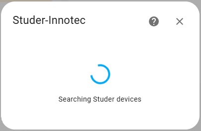
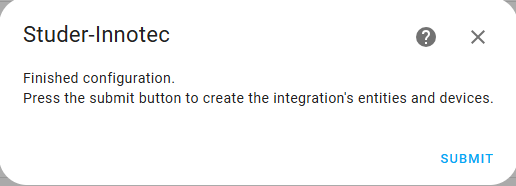

[](https://github.com/ankohanse/hass-studer-xcom)
[](https://github.com/ankohanse/hass-dab-pumpsstuder-xcom)
[](LICENSE)
[](https://github.com/custom-components/hacs)<br/>
[](https://www.buymeacoffee.com/ankohanse)


# Hass-Studer-Xcom

[Home Assistant](https://home-assistant.io/) custom component for retrieving sensor information from Studer-Innotec devices.
This component connects directly over the local network using the Studer xcom protocol.

The custom component was tested with:
- Xtender XTH 8000-48 (but should also work for other XTH, XTS and XTM)
- Xcom-CAN (BSP connection to a third party BMS)
- Xcom-LAN (which actually is a Xcom232i with a Moxy NPort 5110A)

It should also be able to detect and handle
- Studer BMS
- VarioTrack
- VarioString
- RCC

This custom component provides a more reliable alternative to polling data from the Studer Portal via http as described in [Read Studer Parameters via Xcom-LAN and Rest Sensor](https://community.home-assistant.io/t/read-studer-parameters-via-xcom-lan-and-rest-sensor/597933).

# Prerequisites
This device depends on having a Studer Xcom-LAN (i.e. an Xcom-232i and a Moxa ethernet gateway) acting as a Xcom client and connecting to this integration. For older systems this will be a separate component, for future systems Studer have indicated that LAN connection will become part of the Xtender range.

The Studer Xcom-LAN will be able to simultaneously send data to the Studer online portal as well as sending data to this integration.

Configuration steps:

1. Download and install the Moxa DSU tool (Device Search Utility)
    - Open www.moxa.com in a browser
    - Select Support -> Software and Documentation
    - Choose NPort 5100A series (or whatever specific device you have)
    - Scroll down under 'Related Software, Firmware and Drivers' to find 'Device Search Utility'
    - Download and install the utility

2. Locate the Moxa NPort device on the local network
    - Run the Moxa Device Search Utility
    - Press the 'Search' button and wait until the search finishes
    - The utility should display the found NPort device
    - Double click on the found device to open its configuration page

      

3. Configure the Moxa NPort device
    - In the Main Menu, select 'Operating Settings' -> Port 1
    - Verify that 'Operation Mode' is set to 'TCP Client'
    - Add the ip-address or network name of your HomeAssistant as 'Destination IP address'
    - Press the 'Submit' button
    - Press 'Save/Restart'

      


# Installation

## HACS
This custom integration is waiting to be included into the HACS default integrations.
Until that time, you can add it as a HACS custom repository:
1. In the HACS page, press the three dots at the top right corner.
2. Select 'Custom Repositories'
3. Enter repository "https://github.com/ankohanse/hass-studer-xcom" (with the quotes seems to work better)
4. select category 'integration' and press 'Add'
2. Restart Home Assistant.
3. Follow the UI based [Configuration](#configuration)


## Manual install
1. Under the `<config directory>/custom_components/` directory create a directory called `studer_xcom`. 
Copying all files in `/custom_components/studer_xcom/` folder from this repo into the new `<config directory>/custom_components/studer_xcom/` directory you just created.

    This is how your custom_components directory should look like:

    ```bash
    custom_components
    ├── studer_xcom
    │   ├── translations
    │   │   └── en.json
    │   ├── __init__.py
    │   ├── binary_sensor.py
    │   ├── config_flow.py
    │   ├── const.py
    │   ├── coordinator.py
    │   ├── diagnostics.py
    │   ├── entity_base.py
    │   ├── manifest.json
    │   ├── number.py
    │   ├── select.py
    │   ├── sensor.py
    │   ├── strings.json
    │   ├── switch.py
    │   ├── xcom_api.py
    │   ├── xcom_const.py
    │   ├── xcom_datapoints.json
    │   ├── xcom_datapoints.py
    │   ├── xcom_families.py
    │   └── xcom_protocol.py  
    ```

2. Restart Home Assistant.
3. Follow the UI based [Configuration](#configuration)

# Configuration
To start the setup of this custom integration:
- go to Home Assistant's Integration Dashboard
- Add Integration
- Search for 'Studer-Innotec'
- Follow the prompts in the configuration step

## Step 1 - Client details
The following properties are required to connect to Xcom client on the local network
- Port: specify the port as set in the Moxa NPort confuguration. Default 4001
  


## Step 2 - Xcom discovery
The integration will wait until the Xcom client connects to it. Next, it will try to detect any connected Studer devices.
This is a fully automatic step, no user input needed.



## Step 3 - Params and infos numbers
Choose the params and info numbers you want for each detected device.

A full list of available numbers can be downloaded from Studer-Innotec:
- Open studer.innotec.com in a browser
- Go to Downloads -> Openstuder -> communication protocol xcom 232i
- In the downloaded zip open file 'Technical specification - Xtender serial protocol appendix - 1.6.38.pdf'
  


## Step 4 - Finish
Press submit to create all entities (sensors, switches, numbers, etc) for the configured params and infos numbers
  


## Step 5 - Success
After succcessful setup, all devices from the Studer installation should show up.


On the individual device pages, the hardware related device information is displayed, together with sensors typically grouped into main entity sensors, controls and diagnostics.

Any sensors that you do not need can be manually disabled using the HASS GUI.


# Troubleshooting
Please set your logging for the this custom component to debug during initial setup phase. If everything works well, you are safe to remove the debug logging.

```yaml
logger:
  default: warn
  logs:
    custom_components.studer_xcom: debug
```


# Credits

Special thanks to the following people for providing the information this custom integration is based on:
- [Michael Jeffers](https://community.home-assistant.io/u/JeffersM)


