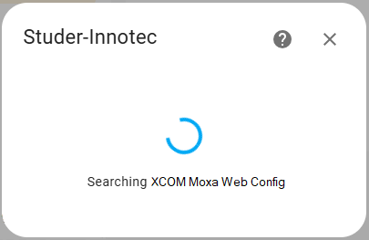
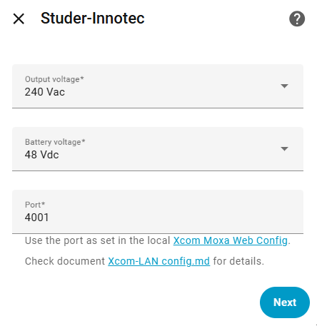
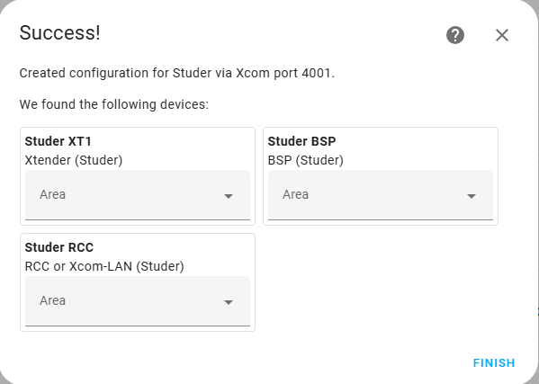
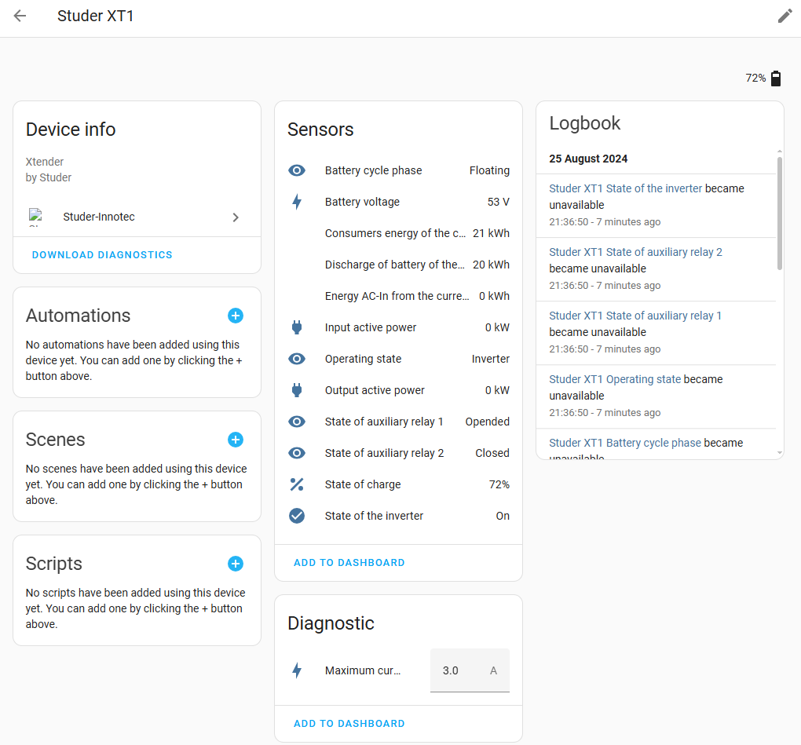
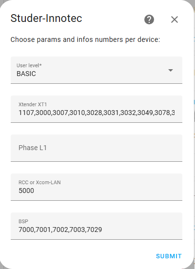

[](https://github.com/ankohanse/hass-studer-xcom)
[](https://github.com/custom-components/hacs)
[](https://github.com/ankohanse/hass-studer-xcom)<br/>
[](https://github.com/ankohanse/hass-studer-xcom/blob/main/LICENSE)
[](https://www.buymeacoffee.com/ankohanse)


# Hass-Studer-Xcom

[Home Assistant](https://home-assistant.io/) custom component for retrieving sensor information from Studer-Innotec devices.
This component connects directly over the local network using the Studer xcom protocol.

The custom component is comfirmed to be compatible with:
- Xtender XTH 8000-48, XTM 4000-48
- Xcom-CAN (BSP connection to a third party BMS)
- Xcom-LAN (which actually is a Xcom232i with a Moxy NPort 5110A)
- BMS
- RCC-03
- VarioTrack

It should also be able to detect and handle
- Xtender (any other XTH, XTS and XTM models)
- VarioString
- RCC-02

This custom component provides a more reliable alternative to polling data from the Studer Portal via http as described in [Read Studer Parameters via Xcom-LAN and Rest Sensor](https://community.home-assistant.io/t/read-studer-parameters-via-xcom-lan-and-rest-sensor/597933).


# Prerequisites

This device depends on having a Studer Xcom-LAN (i.e. an Xcom-232i and a Moxa ethernet gateway) acting as a Xcom client and connecting to this integration. For older systems this will be a separate component, for future systems Studer have indicated that LAN connection will become part of the Xtender range.

The Studer Xcom-LAN is able to simultaneously send data to the Studer online portal as well as sending data to this integration.


# Installation

## HACS

This custom integration is waiting to be included into the HACS default integrations.
Until that time, you can add it as a HACS custom repository:
1. In the HACS page, press the three dots at the top right corner.
2. Select 'Custom Repositories'
3. Enter repository "https://github.com/ankohanse/hass-studer-xcom" (with the quotes seems to work better)
4. select category 'integration' and press 'Add'
2. Restart Home Assistant.
3. Follow the UI based [Initial Configuration](#initial-configuration)


## Manual install

1. Under the `<config directory>/custom_components/` directory create a directory called `studer_xcom`. 
Copying all files in `/custom_components/studer_xcom/` folder from this repo into the new `<config directory>/custom_components/studer_xcom/` directory you just created.

    This is how your custom_components directory should look like:

    ```bash
    custom_components
    ├── studer_xcom
    │   ├── translations
    │   │   └── en.json
    │   ├── __init__.py
    │   ├── binary_sensor.py
    │   ├── button.py
    │   ├── config_flow.py
    │   ├── const.py
    │   ├── coordinator.py
    │   ├── diagnostics.py
    │   ├── entity_base.py
    │   ├── manifest.json
    │   ├── number.py
    │   ├── select.py
    │   ├── sensor.py
    │   ├── strings.json
    │   └── switch.py
    ```

2. Restart Home Assistant.
3. Follow the UI based [Initial Configuration](#initial-configuration)


# Initial Configuration

To start the setup of this custom integration:
- go to Home Assistant's Integration Dashboard
- Press 'Add Integration'
- Search for 'Studer-Innotec'
- Follow the prompts in the configuration steps

## Step 1 - Moxa discovery

The integration will try to detect the url to the Moxa Web Config in the local network.
This is a fully automatic step, no user input needed.

Do not run Configuration via a Nabu Casa cloud connection, as that will lead to the process getting stuck at the end of this step (known issue). Running Configuration from within the local network does not have this issue. See section [Knowledge base](#knowledge-base) for more information.



## Step 2 - Client details

The following properties are required to connect to Xcom client on the local network
- AC voltage: choose between 120 Vac or 240 Vac; used to select the correct Xcom params min and max values
- Port: specify the port as set in the Moxa NPort configuration. Default 4001
  


If the discovery of Studer devices in step 2 fails then the configuration returns to the screen of step 1.
In that case, check the configuration of the Xcom-LAN device as described in document [Xcom-LAN config.md](Xcom-LAN%20config.md)

## Step 3 - Xcom discovery

The integration will wait until the Xcom client connects to it. Next, it will try to detect any connected Studer devices.
This is a fully automatic step, no user input needed.


## Step 4 - Finish

After succcessful setup, all dicovered devices from the Studer installation should show up.



On the individual device pages, the hardware related device information is presented. Also displayed here are all default created entities, typically grouped into main entity sensors, controls and diagnostics.

Any entities that you do not need can be manually disabled using the HASS GUI. Or use the steps described under [Options Configuration](#options-configuration) to add or remove entities.




# Custom configuration

The initial configuration will add default info and params entities for the detected Studer devices. Via the custom configuraton, other info and param entities can be added or removed for each device.

To configure:
- Go to Home Assistant's Integration Dashboard
- Click to open the 'Studer-Innotec' integration
- Click on 'Configure'

## Step 1 - Xcom discovery

The integration will wait until the Xcom client connects to it. Next, it will try to detect any newly connected Studer devices.
This is a fully automatic step, no user input needed.

## Step 2 - Params and infos numbers

An overview is shown of (default selected) params and info numbers for each detected device.
In this screen, the actions dropdown box allows you to:
- Add a param or info number to a device via a menu structure
- Add param or info numbers to a device by directly entering the numbers
- Remove param or info numbers from a device by entering the numbers
- Set advanced options

Once you are satisfied with the presented info and params numbers, select action 'Done' and press submit to create all entities (sensors, switches, numbers, etc).



A full list of available numbers can be found in the library used by this integration: 
- [aioxcom/xcom_datapoints_240v.json](https://github.com/ankohanse/aioxcom/blob/master/src/aioxcom/xcom_datapoints_240v.json)

Or it can be downloaded from Studer-Innotec:
- Open [www.studer-innotec.com](https://www.studer-innotec.com) in a browser
- Go to Downloads -> Openstuder -> communication protocol xcom 232i
- In the downloaded zip open file 'Technical specification - Xtender serial protocol appendix - 1.6.38.pdf'

# Entity retrieval limits

Restrict yourself to only those parameters you actually use and try to keep the time needed for fetching Studer Xcom data below 20 seconds. While in debug mode (see below), keep an eye on the log (Settings -> System -> Log -> Load Full Logs ),
and search for lines looking like:

`2024-08-26 09:57:46.383 DEBUG (MainThread) [custom_components.studer_xcom.coordinator] Finished fetching Studer Xcom data in 1.450 seconds (success: True)`

Note: the first data retrieval after a restart will always take longer than subsequent data retrievals.


# Entity writes to device

When the value of a Studer param is changed via this integration (via a Number, Select or Switch entity), these are written via Xcom to the affected device. 
Changes are stored in the device's RAM memory, not in its flash memory as you can only write to flash a limited number of times over its lifetime.

However, reading back the value from the entity will be from flash. 
As a result, the change to the entity value is not visible in the RCC or remote console.
You can only tell from the behavior of the PV system that the Studer param was indeed changed.  

After a restart/reboot of the PV system the system will revert to the value from Flash. So you may want to periodically repeat the write of changed param values via an automation.

**IMPORTANT**:

Be very carefull in changing params marked as having level Expert, Installer or even Qualified Service Person. If you do not know what the effect of a Studer param change is, then do not change it!


# Troubleshooting

Please set your logging for the this custom component to debug during initial setup phase. If everything works well, you are safe to remove the debug logging.

```yaml
logger:
  default: warn
  logs:
    custom_components.studer_xcom: debug
```


# Credits

Special thanks to the following people for providing the information this custom integration is based on:
- [zocker-160](https://github.com/zocker-160/xcom-protocol)
- [Michael Jeffers](https://community.home-assistant.io/u/JeffersM)


# Knowledge base

## Local install
It is recommended to run Configuration on the local network, i.e. from a computer within the same network as where Home Assistant and the Studer devices are connected to.

If for some reasone you do need to run Configuration remotely (via a Nabu Casa cloud connection), then use the following method:
- Connect to the remote Home Assistant 
- Install the [Firefox addon](https://github.com/mincka/ha-addons)
- Open a firefox web browser window via the addon and connect to homeassistant.local:8123
- Add and configure the Studer-Innotec integration.

