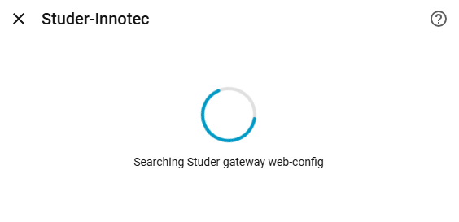
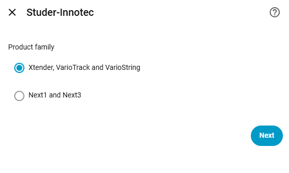
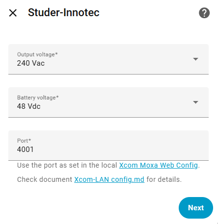
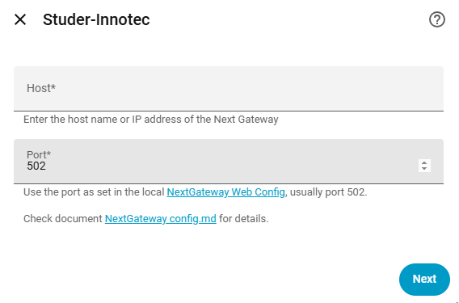
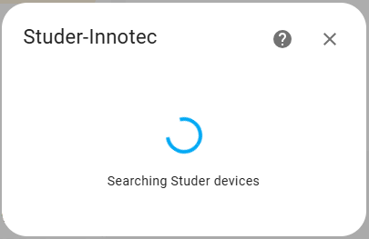
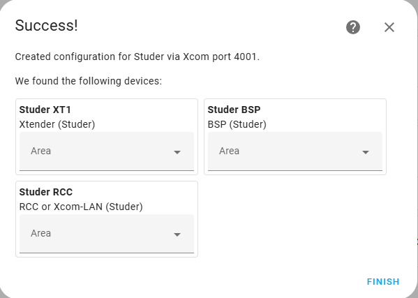
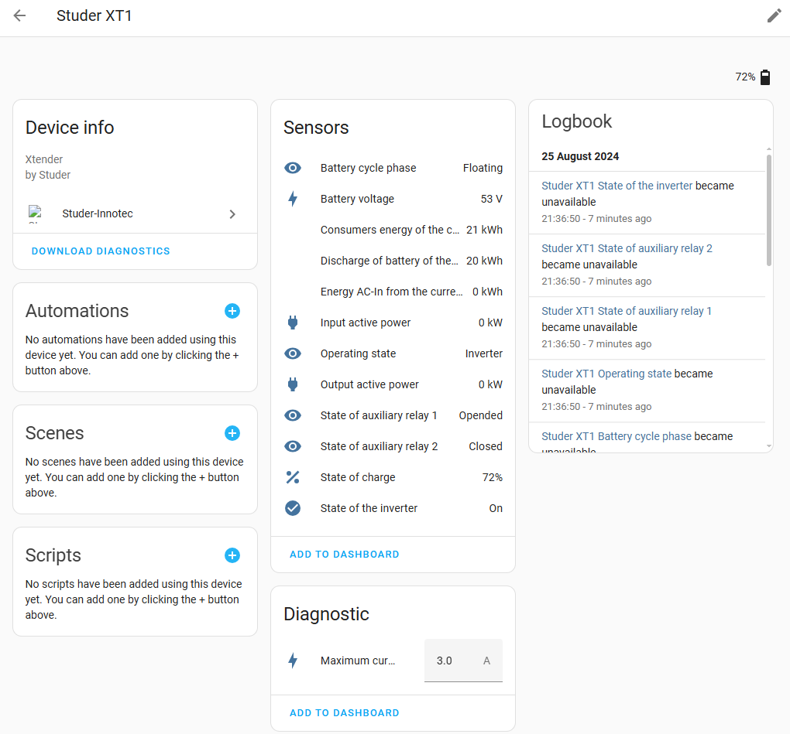
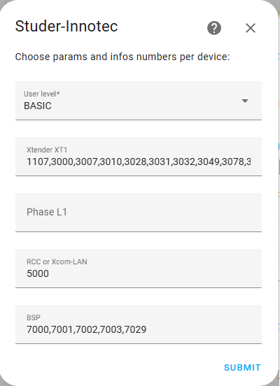

[](https://github.com/ankohanse/hass-studer-xcom)
[](https://github.com/custom-components/hacs)
[](https://github.com/ankohanse/hass-studer-xcom)
[](https://github.com/ankohanse/hass-studer-xcom/blob/main/LICENSE)
[](https://www.buymeacoffee.com/ankohanse)


# Studer-Innotec

[Home Assistant](https://home-assistant.io/) custom component for retrieving sensor information from Studer-Innotec devices.
This component connects directly over the local network using the Studer xcom protocol.

The custom component is comfirmed to support:
- Xtender XTH, XTM and XTS
- Xcom-CAN (BSP connection to a third party BMS)
- Xcom-LAN (which actually is a Xcom232i with a Moxy NPort 5110A)
- BMS, RCC-02, RCC-03
- VarioString, VarioTrack

It should also support:
- Next1, Next3

For Xtender products, this custom component provides a more reliable alternative to polling data from the Studer Portal via http as described in [Read Studer Parameters via Xcom-LAN and Rest Sensor](https://community.home-assistant.io/t/read-studer-parameters-via-xcom-lan-and-rest-sensor/597933). 

For Next1 and Next3 products it provides a more user friendly alternative to manually configuring the modbus registers.


# Prerequisites 
## Xtender product family

This device depends on having a Studer Xcom-LAN (i.e. an Xcom-232i and a Moxa ethernet gateway) acting as a Xcom client and connecting to this integration. For older systems this will be a separate component, for future systems Studer have indicated that LAN connection will become part of the Xtender range.

The Studer Xcom-LAN is able to simultaneously send data to the Studer online portal as well as sending data to this integration.

A detailed description of the required settings can be found in document [Xcom-LAN config.md](Xcom-LAN%20config.md)

## Next product family
This library depends on the Next3/Next1 configured to have modbus TCP enabled.

A detailed description of the required settings can be found in document [Next-Gateway config.md](Next-Gateway%20config.md)

# Installation

## HACS

This custom integration is available via HACS (Home Assistant Community Store).
1. In the HACS page, seach for 'Studer'.
2. Click on the found item to display this readme (this page).
3. At the bottom of the page press 'Download'
4. Restart Home Assistant.
5. Follow the UI based [Initial Configuration](#initial-configuration)


## Manual install

1. Under the `<config directory>/custom_components/` directory create a directory called `studer_xcom`. 
2. Copy all files in this github repository in the `/custom_components/studer_xcom/` folder into the new `<config directory>/custom_components/studer_xcom/` directory you just created.

    This is how your custom_components directory should look like:

    ```bash
    custom_components
    ├── studer_xcom
    │   ├── translations
    │   │   └── en.json
    │   ├── __init__.py
    │   ├── binary_sensor.py
    │   ├── button.py
    │   ├── config_flow.py
    │   ├── const.py
    │   ├── coordinator.py
    │   ├── diagnostics.py
    │   ├── entity_base.py
    │   ├── entity_helper.py
    │   ├── manifest.json
    │   ├── number.py
    │   ├── select.py
    │   ├── sensor.py
    │   ├── strings.json
    │   ├── switch.json
    │   └── time.py
    ```

2. Restart Home Assistant.
3. Follow the UI based [Initial Configuration](#initial-configuration)


# Initial Configuration

To start the setup of this custom integration:
- go to Home Assistant's Integration Dashboard
- Press 'Add Integration'
- Search for 'Studer-Innotec'
- Follow the prompts in the configuration steps

## Step 1 - Gateway web-config discovery

The integration will try to detect the url to the gateway web-config in the local network.
This is a fully automatic step, no user input needed.

Do not run Configuration via a Nabu Casa cloud connection, as that will lead to the process getting stuck at the end of this step (known issue). Running Configuration from within the local network does not have this issue. See section [Knowledge base](#knowledge-base) for more information.



## Step 2 - Product family

Choose the product family that applies to your device(s).



## Step 3a - Xcom gateway details

Enter the properties are required to connect to the Xcom gateway on the local network.
  


If the discovery of Studer devices in step 4 fails then the configuration returns to the screen of step 3a.
In that case, check the configuration of the Xcom-LAN device as described in document [Xcom-LAN config.md](Xcom-LAN%20config.md)

## Step 3b - Next gateway details

Enter the properties are required to connect to the Next gateway on the local network
  


If the discovery of Studer devices in step 4 fails then the configuration returns to the screen of step 3b.
In that case, check the configuration of the Next Gateway as described in document [Next-Gateway config.md](Next-Gateway%20config.md)

## Step 4 - Device discovery

The integration will connect to the gateway. Next, it will try to detect any Studer devices connected to the gateway.
This is a fully automatic step, no user input needed.



## Step 5 - Finish

After succcessful setup, all dicovered devices from the Studer installation should show up.



On the individual device pages, the hardware related device information is presented. Also displayed here are all default created entities, typically grouped into main entity sensors, controls and diagnostics.

Any entities that you do not need can be manually disabled using the Home Assistant GUI. Or use the steps described under [Custom Configuration](#custom-configuration) to add or remove entities.




# Custom configuration

The initial configuration will add default entities for the detected Studer devices. Via the custom configuraton, other entities can be added or removed for each device.

To configure:
- Go to Home Assistant's Integration Dashboard
- Click to open the 'Studer-Innotec' integration
- Click on 'Configure'

## Step 1 - Device discovery

The integration will connect to the configured gateway. Next, it will try to detect any newly connected Studer devices.
This is a fully automatic step, no user input needed.

## Step 2 - Entitiy numbers

An overview is shown of (default selected) entity numbers for each detected device.
In this screen, the actions dropdown box allows you to:
- Add an entity to a device via a menu structure
- Add entities to a device by directly entering their numbers
- Remove entities from a device by entering the numbers
- Set advanced options

Once you are satisfied with the presented entity numbers, select action 'Done' and press submit to create all entities (sensors, switches, numbers, etc).



A full list of available numbers can be found in the libraries used by this integration: 
- [pystuderxcom/xcom_datapoints_240v.json](https://github.com/ankohanse/pystuderxcom/blob/master/src/pystuderxcom/xcom_datapoints_240v.json)

or
- [pystudernext/datapoints_sys.json](https://github.com/ankohanse/pystudernext/blob/master/src/pystudernext/datapoints_sys.json)
- [pystudernext/datapoints_bat.json](https://github.com/ankohanse/pystudernext/blob/master/src/pystudernext/datapoints_bat.json)
- [pystudernext/datapoints_acs.json](https://github.com/ankohanse/pystudernext/blob/master/src/pystudernext/datapoints_acs.json)
- [pystudernext/datapoints_flx.json](https://github.com/ankohanse/pystudernext/blob/master/src/pystudernext/datapoints_flx.json)
- [pystudernext/datapoints_nx1.json](https://github.com/ankohanse/pystudernext/blob/master/src/pystudernext/datapoints_nx1.json)
- [pystudernext/datapoints_nx3.json](https://github.com/ankohanse/pystudernext/blob/master/src/pystudernext/datapointsnx3s.json)
- [pystudernext/datapoints_nxg.json](https://github.com/ankohanse/pystudernext/blob/master/src/pystudernext/datapoints_nxg.json)
- [pystudernext/datapoints_pwr.json](https://github.com/ankohanse/pystudernext/blob/master/src/pystudernext/datapoints_pwr.json)


Or it can be downloaded from Studer-Innotec:
- Open [www.studer-innotec.com](https://www.studer-innotec.com) in a browser
- Go to Support -> Downloads -> Openstuder
- Download 'communication protocol xcom 232i' for Xtender, VarioString or VarioTrack devices, 
- Download 'communication protocol next modbus' for Next1 or Next3 devices
 - In the downloaded zip open the file marked as 'appendix'

# Entity retrieval limits

Restrict yourself to only those parameters you actually use and try to keep the time needed for fetching Studer data below 20 seconds. While in debug mode (see below), keep an eye on the log (Settings -> System -> Log -> Load Full Logs ),
and search for lines looking like:

`2024-08-26 09:57:46.383 DEBUG (MainThread) [custom_components.studer_xcom.coordinator] Finished fetching Studer via xyz data in 1.450 seconds (success: True)`

Note: the first data retrieval after a restart might take longer than subsequent data retrievals.


# Entity writes to device

When the value of a Studer entity is changed via this integration (via a Number, Select, Switch or Time entity), these are written to the affected device. 
Changes are stored in the device's volatile memory (RAM), not in its persistant/non-volatile memory (Flash) as you can only write to persistent memory a limited number of times over its lifetime.

However, reading back the value for the entity will be from flash. 
As a result, the change to the entity value is not visible in the RCC or remote console.
You can only tell from the behavior of the PV system that the Studer entity was indeed changed.  

After a restart/reboot of the PV system the system will revert to the value from Flash. So you may want to periodically repeat the write of changed param values via an automation.

**IMPORTANT**:

Be very carefull in changing params marked as having level Expert. If you do not know what the effect of a Studer entity change is, then do not change it!


# Knowledge base
Additional information and tips for the Studer-Innotec custom integration can be found in the [Studer-Innotec Wiki](https://github.com/ankohanse/hass-studer-xcom/wiki)


# Troubleshooting

Please set your logging for the this custom component to debug during initial setup phase. If everything works well, you are safe to remove the debug logging.

```yaml
logger:
  default: warn
  logs:
    custom_components.studer_xcom: debug
```


# Credits

Special thanks to the following people for providing the information this custom integration is based on:
- [zocker-160](https://github.com/zocker-160/xcom-protocol)
- [Michael Jeffers](https://community.home-assistant.io/u/JeffersM)
- [t-baum](https://github.com/t-baum)
- [anakinch75](https://github.com/anakinch75)