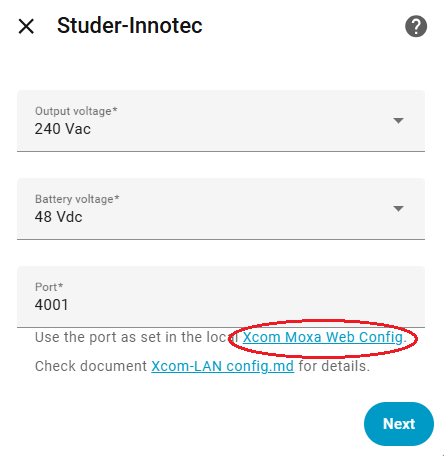
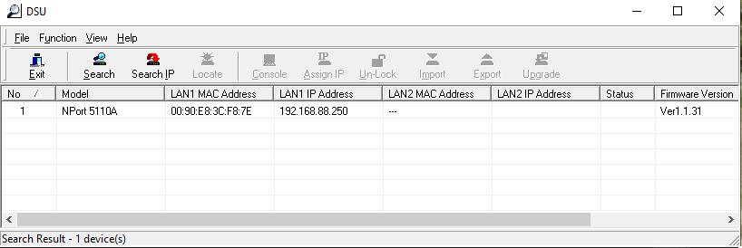

# Xcom-LAN configuration

This device depends on having a Studer Xcom-LAN (i.e. an Xcom-232i and a Moxa ethernet gateway) acting as a Xcom client and connecting to this integration. For older systems this will be a separate component, for future systems Studer have indicated that LAN connection will become part of the Xtender range.

The Studer Xcom-LAN is able to simultaneously send data to the Studer online portal as well as sending data to this integration.

## Moxa Web Config

The Moxa Web Config can be used to configure the Xcom-LAN / Moxa device. To open the web-config, click on the link that was detect during the first step of the integration configuration

Alternatively, follow the steps as described in section [Device Search Utiliy](#device-search-utility)

  - In the Moxa Web Config:
    - In the Main Menu, select 'Operating Settings' -> Port 1
    - Verify that 'Operation Mode' is set to 'TCP Client'
    - Add the ip-address or network name of your HomeAssistant as 'Destination IP address'
    - Press the 'Submit' button
    - Press 'Save/Restart'

      

## Device Search Utility

If the first step of the integration step was not able to locate the link to the Moxa Web Config, then an alternative method can be used.

1. Download and install the Moxa DSU tool (Device Search Utility)
    - Open [www.moxa.com](https://www.moxa.com) in a browser
    - Select Support -> Software and Documentation
    - Choose NPort 5100A series (or whatever specific device you have)
    - Scroll down under 'Related Software, Firmware and Drivers' to find 'Device Search Utility'
    - Download and install the utility

2. Locate the Moxa NPort device on the local network
    - Run the Moxa Device Search Utility
    - Press the 'Search' button and wait until the search finishes
    - The utility should display the found NPort device
    - Double click on the found device to open its configuration page

      

3. Continue as described in section [Moxa configuration](#moxa-configuration)
